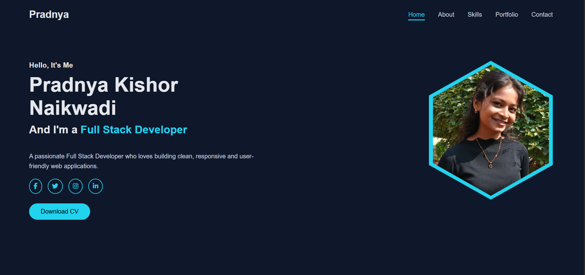
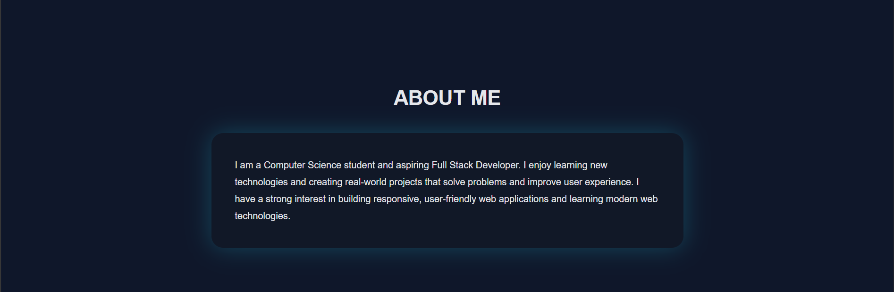
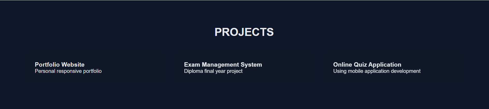
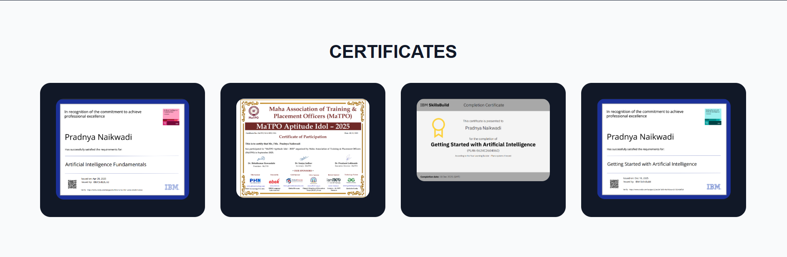
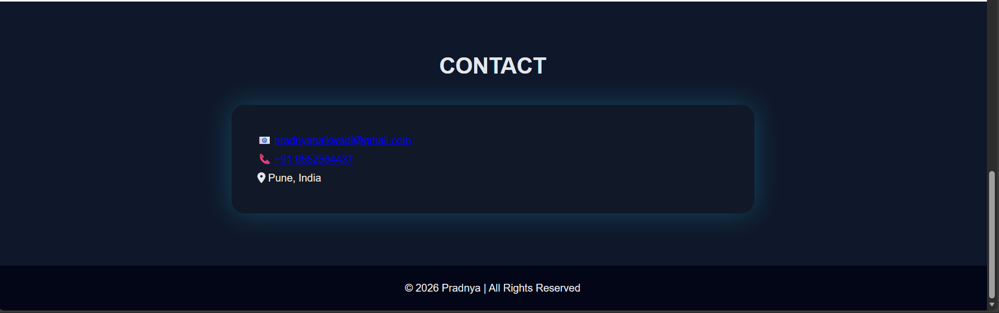

# Version 1 – Portfolio Structure (HTML & CSS)
### Main Head

### Skills

### Certificates

### Footer

     

# Version 2 – Portfolio Structure (HTML & CSS Styling)
##  Project Screenshots

### Header

### About

### Skills

### Projects

### Certificates

### Contact

